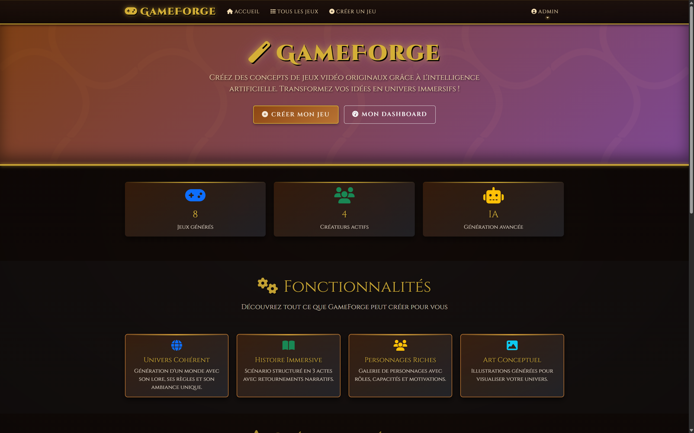
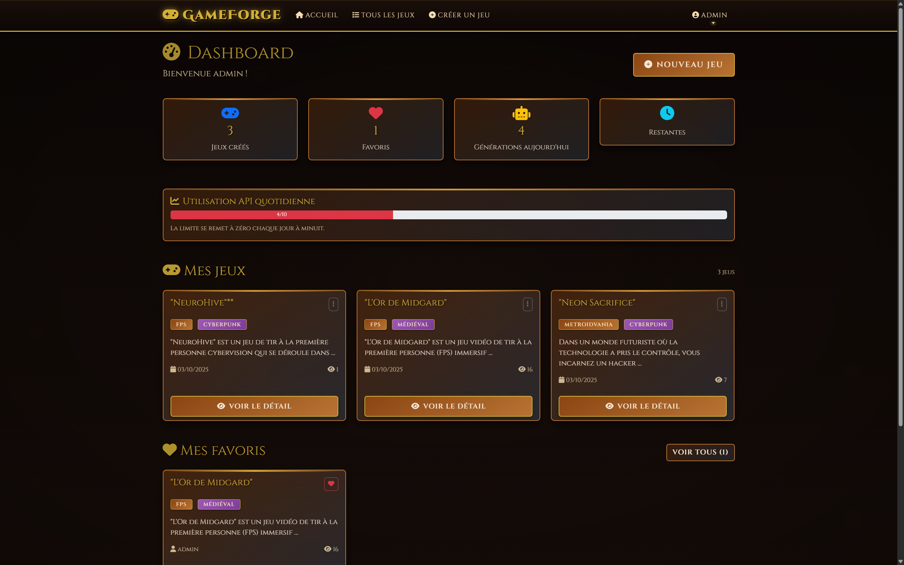
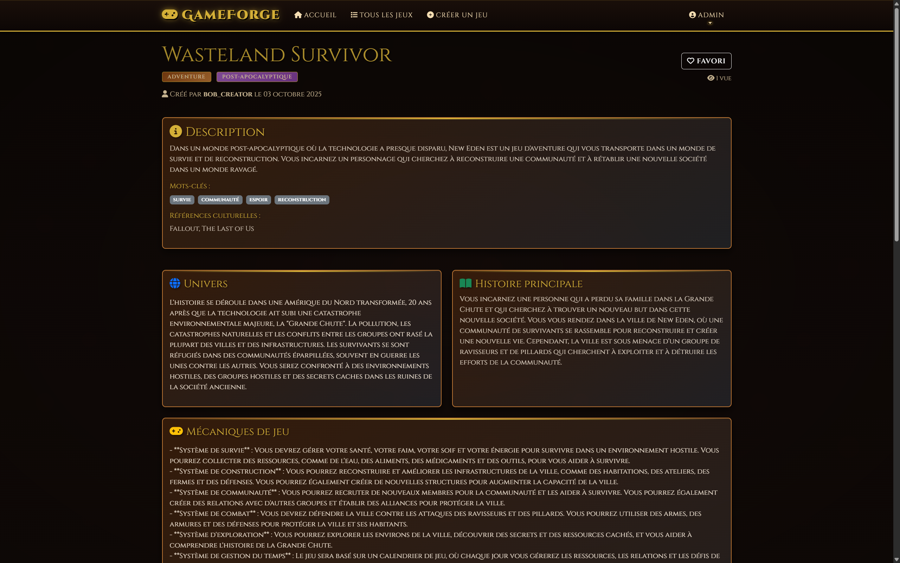
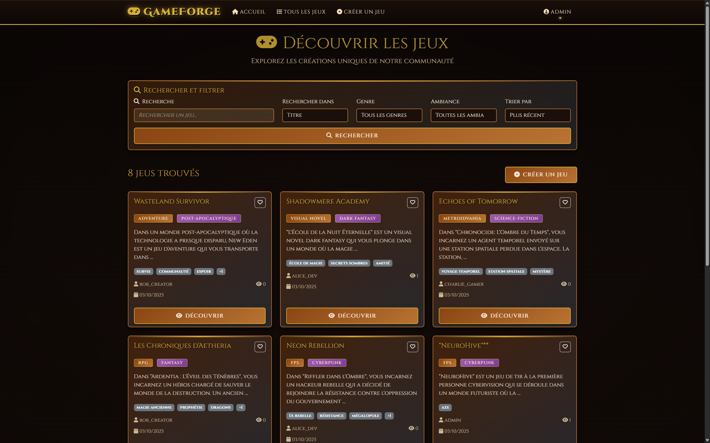
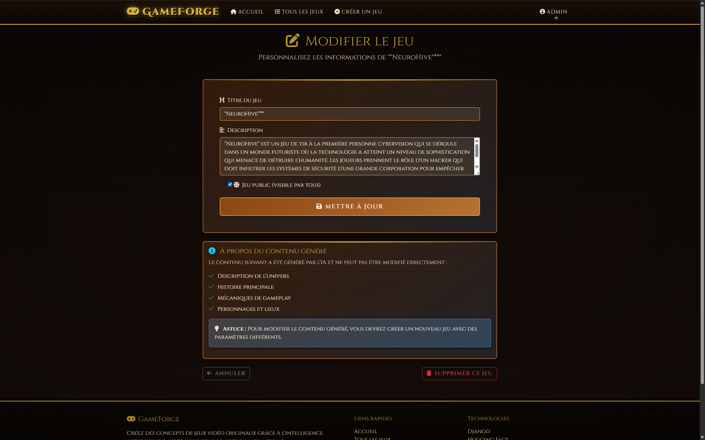
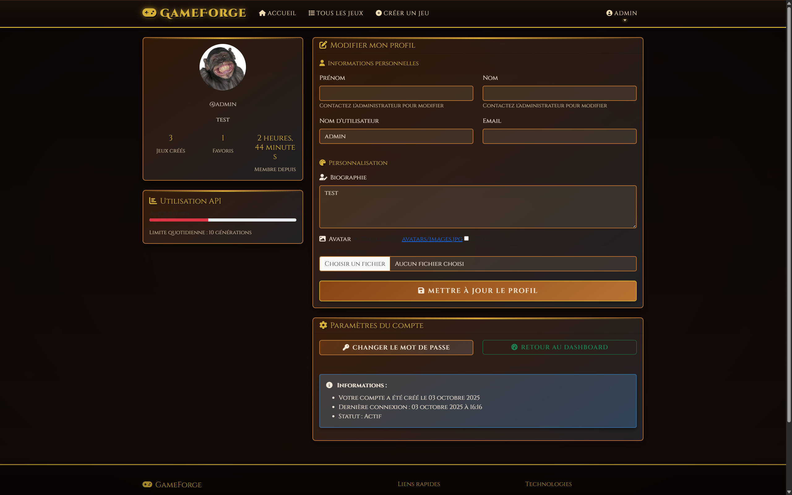

# 🎮 GameForge - Générateur de jeux vidéo par IA

Une plateforme web complète développée avec Django permettant aux utilisateurs de créer des concepts de jeux vidéo originaux à l'aide de l'intelligence artificielle.


## 🌟 Fonctionnalités principales

### 🎯 Génération de jeux par IA
- **Interface intuitive** : Navigation fluide avec animations CSS
# 🎮 GameForge - Générateur de jeux vidéo par IA

## Présentation du projet
GameForge est une plateforme web développée avec Django permettant aux utilisateurs de générer des concepts de jeux vidéo originaux grâce à l'intelligence artificielle. L'application propose la création automatisée d'univers, d'histoires, de personnages et de lieux, ainsi qu'une gestion complète des créations et des favoris.

## Schéma de la transition des données
...

## Instructions d'installation

### Prérequis
- Python 3.8 ou supérieur
- pip
- Git

## Screenshots de l'application








## Bonus implémentés
- Système de favoris en AJAX
- Limitation quotidienne d'usage API par utilisateur
- Dashboard personnalisé
- Recherche et filtrage avancés
- Upload d'avatar utilisateur
- Design responsive et thème sombre
- Statistiques d'utilisation

## Limites et fonctionnalités non réalisées
- Système de commentaires et notation des jeux
- Export PDF stylisé et API publique
- Déploiement Docker et cache Redis

---


### 🔐 Système d'authentification complet
- **Inscription/Connexion** : Système sécurisé avec validation
- **Profils utilisateur** : Personnalisation avec avatar et biographie
- **Gestion des sessions** : Authentification persistante
- **Réinitialisation de mot de passe** : Système de récupération par email

### 📊 Dashboard personnel
- **Mes jeux** : Gestion complète des créations personnelles
- **Favoris** : Système de mise en favoris des jeux appréciés
- **Statistiques** : Suivi de l'utilisation API et des performances
- **Paramètres** : Configuration du profil et des préférences

## 🛠️ Technologies utilisées

### Backend
- **Django 4.2.7** : Framework web Python
- **SQLite** : Base de données (développement)
- **Python 3.x** : Langage de programmation

### Frontend
- **Bootstrap 5.3** : Framework CSS responsive
- **Font Awesome 6.4** : Icônes vectorielles
- **Google Fonts** : Typographies (Orbitron, Roboto)
- **JavaScript ES6** : Interactions dynamiques

### 🤖 Modèle d'IA utilisé

- **Groq - llama-3.1_8b-instant** pour la génération des concepts de jeux vidéo. 

***Pourquoi?***
    - Pour sa rapidité d'inférence et sa faible latence grâce à l'infrastructure Groq, sa capacité à générer des textes cohérents et créatifs adaptés au game design. Un coût d'utilisation réduit et une API simple à intégrer.

## 🚀 Installation et configuration

### Prérequis
- Python 3.8 ou supérieur
- pip (gestionnaire de paquets Python)
- Git

### Installation

1. **Cloner le projet**
```bash
git clone <url-du-repo>
cd TPgroupejeuV1
```
2. **Créer le fichier `.env` à la racine du projet**
Ajoutez les clés suivantes dans le fichier `.env` :
```env
AI_API_KEY=<votre_clé_api_groq>
SECRET_KEY=<votre_clé_secrète_django>
HUGGINGFACE_API_KEY=<votre_clé_huggingface>
```

2. **Créer un environnement virtuel**
```bash
python -m venv venv
```

3. **Activer l'environnement virtuel**
```bash
# Windows
.\venv\Scripts\Activate.ps1

# Linux/Mac
source venv/bin/activate
```

4. **Installer les dépendances**
```bash
pip install -r requirements.txt
```

5. **Appliquer les migrations**
```bash
python manage.py makemigrations
python manage.py migrate
```

6. **Créer un superutilisateur**
```bash
python manage.py createsuperuser
```

7. **Créer des données de démonstration**
```bash
python setup.py demo
```

8. **Lancer le serveur de développement**
```bash
python manage.py runserver
```

L'application sera accessible à l'adresse : `http://127.0.0.1:8000`

## 👥 Comptes de test

### Administrateur
- **Utilisateur** : `admin`
- **Mot de passe** : `admin123`

### Utilisateurs de démonstration
- **alice_dev** / `test123`
- **bob_creator** / `test123`
- **charlie_gamer** / `test123`

## 📱 Utilisation

### 1. Création d'un compte
- Accédez à la page d'inscription
- Remplissez le formulaire avec vos informations
- Confirmez votre inscription

### 2. Génération d'un jeu
- Connectez-vous à votre compte
- Cliquez sur "Créer un jeu"
- Choisissez le genre et l'ambiance
- Ajoutez des mots-clés inspirants
- Laissez l'IA générer votre univers !

### 3. Gestion de vos créations
- Accédez à votre dashboard
- Visualisez tous vos jeux créés
- Modifiez les paramètres de visibilité
- Partagez vos créations avec la communauté

### 4. Découverte communautaire
- Explorez les créations des autres utilisateurs
- Utilisez les filtres de recherche
- Ajoutez vos jeux préférés en favoris
- Découvrez de nouveaux genres et ambiances

## 🔧 Architecture du projet

```
gameforge/
├── gameforge/              # Configuration Django
│   ├── settings.py         # Paramètres de l'application
│   ├── urls.py            # URLs principales
│   └── wsgi.py            # Configuration WSGI
├── games/                  # Application principale
│   ├── models.py          # Modèles de données
│   ├── views.py           # Vues et logique métier
│   ├── forms.py           # Formulaires Django
│   ├── admin.py           # Interface d'administration
│   ├── ai_service.py      # Service de génération IA
│   └── signals.py         # Signaux Django
├── templates/              # Templates HTML
│   ├── base.html          # Template de base
│   ├── games/             # Templates des jeux
│   └── registration/      # Templates d'authentification
├── static/                 # Fichiers statiques
├── media/                  # Fichiers uploadés
└── requirements.txt        # Dépendances Python
```
